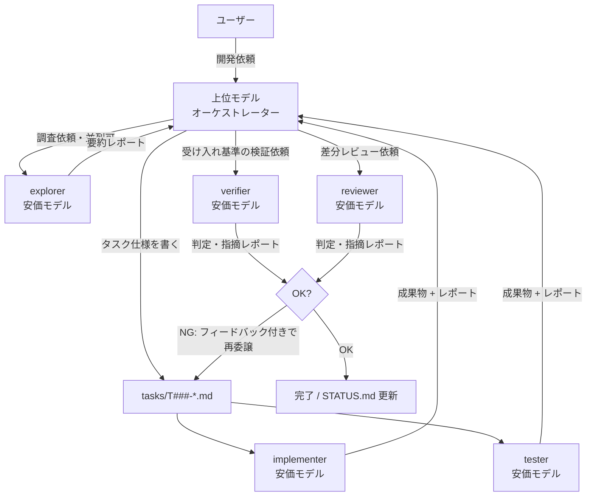

# copilot-cli-template

GitHub Copilot CLI で **上位モデルを「戦略役(オーケストレーター)」**、**安価なモデルのカスタムエージェントを「実働役(ワーカー)」** として使い分けるための開発テンプレートです。

高価な上位モデル(Claude Opus 4.6 など)は計画・指示・検証・意思決定だけに使い、コードを書く・テストする・レビューするといったトークンを大量に消費する作業は単価の安いモデル(既定: GPT-5.3-Codex)のエージェントに任せることで、**AI クレジットの消費を抑えながら品質を保つ**ことを狙います(GitHub Copilot は 2026 年 6 月から全プランがトークンベースの AI クレジット課金です。年額の旧プラン継続中のみプレミアムリクエスト)。

Copilot が標準で認識する仕組み(`AGENTS.md`、`.github/agents/*.agent.md`)だけで構成しているため、**Copilot CLI でも VS Code + GitHub Copilot でも同じ設定がそのまま使えます**。VS Code 専用機能は使っていません。

## コンセプト



| 役割 | モデル | やること | やらないこと |
|---|---|---|---|
| オーケストレーター | 上位モデル(セッションで選択) | 要件整理、タスク分解、仕様書作成、やり直し判断、進捗管理 | 調査・実装・テスト・検証・詳細レビューを自分でやらない |
| explorer | 安価モデル(read/search/execute のみ) | コードベースの調査・影響範囲の特定(**並列委譲可**) | ファイルの修正 |
| implementer | 安価モデル(`.github/agents/` で固定) | タスク仕様に沿った実装 | 仕様外の変更、勝手な設計判断 |
| tester | 安価モデル | テスト作成・実行・失敗解析 | プロダクションコードの書き換え |
| verifier | 安価モデル(read/search/execute のみ) | 受け入れ基準のコマンド実行・合否判定 | コード・テストの修正 |
| reviewer | 安価モデル(read/search/execute のみ) | 差分レビュー、指摘レポート | コードの修正 |

## クイックスタート

1. **このテンプレートからリポジトリを作る**

   ```sh
   gh repo create my-project --template giwarb/copilot-cli-template --private --clone
   cd my-project
   ```

2. **Copilot CLI を上位モデルで起動する**

   ```sh
   copilot
   ```

   起動後に `/model` でオーケストレーター用の上位モデル(例: Claude Opus 4.6)を選択します(モデル ID が分かっていれば `--model` フラグでも指定できます)。

3. **開発したいものを普通に依頼する**

   `AGENTS.md` に運用ルールが書いてあるため、オーケストレーターは自動的に「タスク分解 → tasks/ に仕様書作成 → カスタムエージェントへ委譲 → 検証 → 進捗更新」のループで動きます。

### VS Code + GitHub Copilot で使う場合

同じリポジトリをそのまま VS Code で開けば、`AGENTS.md` と `.github/agents/` のカスタムエージェントが Copilot Chat からも利用できます(エージェントピッカーに explorer / implementer / tester / verifier / reviewer が表示されます)。運用は Copilot CLI の場合と同じです。

## 進捗の見える化

- **`tasks/STATUS.md`** — 全タスクの一覧ボード。オーケストレーターが状態遷移のたびに更新します。これを開いておけば今どこまで進んでいるかが一目で分かります。
- **`tasks/T###-*.md`** — タスクごとの仕様書 + 作業ログ。担当エージェントが末尾の「作業ログ」に追記していくので、経緯を後から追えます。

## オーケストレーターが逸脱するとき

`AGENTS.md` は LLM への指示であり強制力はないため、メインセッション(上位モデル)がタスクを作らず直接コードを書き始めることがあります。その場合の対処:

- **権限プロンプトで止める** — Copilot CLI は既定でファイル書き込み前に承認を求めます。メインセッションが `tasks/` 以外への書き込み承認を求めてきたら **拒否** し、「AGENTS.md の絶対ルールに従って、タスクを作ってワーカーに委譲して」と返します。`--allow-all-tools` での起動は、この防波堤がなくなるため非推奨です。
- **早めに指摘する** — 一度直接編集を許すと、以降のターンでも「前例」として直接編集を続けがちです。最初の逸脱で指摘するのが最も効きます。
- **長いセッションを引きずらない** — コンテキストが長くなるほど冒頭の `AGENTS.md` の遵守率は下がります。話題や作業単位の区切りで新しいセッションを開始してください。

## リポジトリ構成

```
.
├── AGENTS.md              # オーケストレーターの運用ルール(Copilot CLI / VS Code が自動で読む)
├── README.md
├── .github/
│   └── agents/
│       ├── explorer.agent.md     # 調査担当(安価モデル・read/search/execute のみ・並列委譲可)
│       ├── implementer.agent.md  # 実装担当(安価モデル)
│       ├── tester.agent.md       # テスト担当(安価モデル)
│       ├── verifier.agent.md     # 受け入れ検証担当(安価モデル・read/search/execute のみ)
│       └── reviewer.agent.md     # レビュー担当(安価モデル・read/search/execute のみ)
└── tasks/
    ├── STATUS.md          # 進捗ボード
    └── _template.md       # タスク仕様のテンプレート
```

## カスタマイズ

- **ワーカーのモデル変更** — `.github/agents/*.agent.md` の frontmatter `model:` を編集します。既定は `GPT-5.3-Codex`(さらに節約したい場合は `gpt-5-mini` や `claude-haiku-4.5` へ)。利用可能なモデル ID は Copilot CLI の `/model` 一覧で確認してください。指定したモデルがプランで使えない場合は `model:` 行を削除すればセッションのモデルが使われます。
- **Auto モデル選択(10% 割引)を使う** — frontmatter の `model:` に `auto` を指定する方法は現時点で文書化されていません。Auto を使いたい場合は各エージェントの `model:` 行を削除し、セッションのモデルを `/model` で Auto にしてください(`model:` 未指定のエージェントはセッションのモデルを継承します)。この場合オーケストレーターも Auto になる点に注意。
- **エージェントの追加** — `.github/agents/<名前>.agent.md` を追加するだけです。ドキュメント作成専用などプロジェクトに合わせた役割を足せます。
- **ユーザー単位のエージェント** — リポジトリ横断で使いたい場合は `~/.copilot/agents/` に置けます(同名ならホーム側が優先)。
- 言語・フレームワーク固有のビルド/テストコマンドが決まったら、`AGENTS.md` の「プロジェクト固有情報」セクションに追記してください。

## ライセンス

MIT
