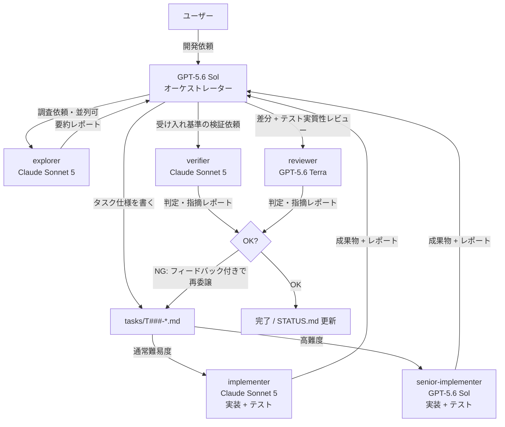

# copilot-cli-template

GitHub Copilot CLI で **上位モデルを「戦略役(オーケストレーター)」**、**役割に合わせたモデルのカスタムエージェントを「実働役(ワーカー)」** として使い分けるための開発テンプレートです。

最上位モデル(GPT-5.6 Sol)は計画・指示・検証・意思決定だけに使い、トークンを大量に消費する実作業は役割ごとに適したモデルに任せます — 通常の実装 + テストは Claude Sonnet 5、設計判断を伴う高難度実装は GPT-5.6 Sol、レビューは GPT-5.6 Terra、調査と受け入れ検証は Claude Sonnet 5。これにより **AI クレジットの消費を抑えながら品質を保つ**ことを狙います(GitHub Copilot は 2026 年 6 月から全プランがトークンベースの AI クレジット課金です。年額の旧プラン継続中のみプレミアムリクエスト)。

Copilot が標準で認識する仕組み(`AGENTS.md`、`.github/agents/*.agent.md`)だけで構成しているため、**Copilot CLI でも VS Code + GitHub Copilot でも同じ設定がそのまま使えます**。VS Code 専用機能は使っていません。

## コンセプト



| 役割 | モデル | やること | やらないこと |
|---|---|---|---|
| オーケストレーター | GPT-5.6 Sol(セッションで選択) | 曖昧な依頼を迷いなく進められるタスクに分解、難易度判定、仕様書作成、やり直し判断、品質の最終保証、進捗管理 | 調査・実装・テスト・検証・詳細レビューを自分でやらない。検証工程の省略もしない |
| explorer | Claude Sonnet 5(read/search/execute のみ) | コードベースの調査・影響範囲の特定(**並列委譲可**) | ファイルの修正 |
| implementer | Claude Sonnet 5 | 通常難易度の実装 + テスト作成(セットで納品) | 仕様外の変更、勝手な設計判断 |
| senior-implementer | GPT-5.6 Sol | 設計判断を伴う高難度の実装 + テスト作成 | 仕様外の変更(必要なら提案止まり) |
| verifier | Claude Sonnet 5(read/search/execute のみ) | 受け入れ基準のコマンド実行・合否判定 | コード・テストの修正 |
| reviewer | GPT-5.6 Terra(read/search/execute のみ) | 差分レビューと**テストが意味のある検証になっているか**のチェック | コードの修正 |

### モデル構成の考え方

- **実装者とテスト作成者は分けない。** 実装した本人がテストも書く方が文脈の分断と往復がなく、トークン効率も良い。「実装者が自分に甘いテストを書く」リスクは、reviewer(GPT-5.6 Terra)がテストの実質性(弱いアサーション、実装と同じバグを写したテスト、境界値の欠落など)を専門観点としてチェックすることで担保する。
- **難易度で実装モデルを分ける。** 定型的な実装は Claude Sonnet 5 で十分。複数モジュール横断の設計判断、並行処理、失敗コストの高い領域は GPT-5.6 Sol(senior-implementer)に出す。判定基準は `AGENTS.md` に明文化してある。
- **レビューはバランス型の GPT-5.6 Terra。** 実装モデル(Sonnet 5)と別系統のモデルにすることで、同じ盲点を共有しにくくする狙いもある。
- **調査・検証は Claude Sonnet 5。** 読んで要約する・コマンドを実行して判定するタスクは、最上位モデルである必要がない。

> **重要: セッションは必ず GPT-5.6 Sol で起動すること。** Copilot CLI はサブエージェントの `model:` がセッションのモデルより高コストな場合、指定を黙って無視してセッションモデルに降格させます(cost-multiplier guard)。セッションを安いモデルで起動すると、senior-implementer の GPT-5.6-Sol 指定が効かなくなります。なお GPT-5.6 Sol は Copilot Pro+ / Max / Business / Enterprise プランでのみ利用できます(Terra / Luna は Pro でも可)。

## クイックスタート

1. **このテンプレートからリポジトリを作る**

   ```sh
   gh repo create my-project --template giwarb/copilot-cli-template --private --clone
   cd my-project
   ```

2. **Copilot CLI を上位モデルで起動する**

   ```sh
   copilot
   ```

   起動後に `/model` でオーケストレーター用に **GPT-5.6 Sol** を選択します(モデル ID が分かっていれば `--model` フラグでも指定できます)。前述のとおり、セッションのモデルより高コストなサブエージェント指定は無視されるため、必ず最上位モデルで起動してください。

3. **開発したいものを普通に依頼する**

   `AGENTS.md` に運用ルールが書いてあるため、オーケストレーターは自動的に「タスク分解 → tasks/ に仕様書作成 → カスタムエージェントへ委譲 → 検証 → 進捗更新」のループで動きます。

### VS Code + GitHub Copilot で使う場合

同じリポジトリをそのまま VS Code で開けば、`AGENTS.md` と `.github/agents/` のカスタムエージェントが Copilot Chat からも利用できます(エージェントピッカーに explorer / implementer / senior-implementer / verifier / reviewer が表示されます)。運用は Copilot CLI の場合と同じです。

## 進捗の見える化

- **`tasks/STATUS.md`** — 全タスクの一覧ボード。オーケストレーターが状態遷移のたびに更新します。これを開いておけば今どこまで進んでいるかが一目で分かります。
- **`tasks/T###-*.md`** — タスクごとの仕様書 + 作業ログ。担当エージェントが末尾の「作業ログ」に追記していくので、経緯を後から追えます。

## オーケストレーターが逸脱するとき

`AGENTS.md` は LLM への指示であり強制力はないため、メインセッション(上位モデル)がタスクを作らず直接コードを書き始めることがあります。その場合の対処:

- **権限プロンプトで止める** — Copilot CLI は既定でファイル書き込み前に承認を求めます。メインセッションが `tasks/` 以外への書き込み承認を求めてきたら **拒否** し、「AGENTS.md の絶対ルールに従って、タスクを作ってワーカーに委譲して」と返します。`--allow-all-tools` での起動は、この防波堤がなくなるため非推奨です。
- **早めに指摘する** — 一度直接編集を許すと、以降のターンでも「前例」として直接編集を続けがちです。最初の逸脱で指摘するのが最も効きます。
- **長いセッションを引きずらない** — コンテキストが長くなるほど冒頭の `AGENTS.md` の遵守率は下がります。話題や作業単位の区切りで新しいセッションを開始してください。

## リポジトリ構成

```
.
├── AGENTS.md              # オーケストレーターの運用ルール(Copilot CLI / VS Code が自動で読む)
├── README.md
├── .github/
│   └── agents/
│       ├── explorer.agent.md            # 調査担当(claude-sonnet-5・read/search/execute のみ・並列委譲可)
│       ├── implementer.agent.md         # 実装 + テスト担当・通常難易度(claude-sonnet-5)
│       ├── senior-implementer.agent.md  # 実装 + テスト担当・高難度(GPT-5.6-Sol)
│       ├── verifier.agent.md            # 受け入れ検証担当(claude-sonnet-5・read/search/execute のみ)
│       └── reviewer.agent.md            # レビュー + テスト実質性チェック担当(GPT-5.6-Terra・read/search/execute のみ)
└── tasks/
    ├── STATUS.md          # 進捗ボード
    └── _template.md       # タスク仕様のテンプレート
```

## カスタマイズ

- **ワーカーのモデル変更** — `.github/agents/*.agent.md` の frontmatter `model:` を編集します。既定は claude-sonnet-5(explorer / implementer / verifier)、GPT-5.6-Sol(senior-implementer)、GPT-5.6-Terra(reviewer)。さらに節約したい場合は explorer / verifier を `gpt-5.6-luna` や `claude-haiku-4.5` に落とすのが効果的です。利用可能なモデルと表記は Copilot CLI の `/model` 一覧で確認し、認識されない場合は一覧の表記に合わせてください(このリポジトリでは GPT 系は `GPT-5.6-Sol` のような大文字ハイフン表記、Claude 系は `claude-sonnet-5` のような小文字表記で動作確認しています)。指定したモデルがプランで使えない場合は `model:` 行を削除すればセッションのモデルが使われます。
- **Auto モデル選択(10% 割引)を使う** — frontmatter の `model:` に `auto` を指定する方法は現時点で文書化されていません。Auto を使いたい場合は各エージェントの `model:` 行を削除し、セッションのモデルを `/model` で Auto にしてください(`model:` 未指定のエージェントはセッションのモデルを継承します)。この場合オーケストレーターも Auto になる点に注意。
- **エージェントの追加** — `.github/agents/<名前>.agent.md` を追加するだけです。ドキュメント作成専用などプロジェクトに合わせた役割を足せます。
- **ユーザー単位のエージェント** — リポジトリ横断で使いたい場合は `~/.copilot/agents/` に置けます(同名ならホーム側が優先)。
- 言語・フレームワーク固有のビルド/テストコマンドが決まったら、`AGENTS.md` の「プロジェクト固有情報」セクションに追記してください。

## この README は「育てる」ドキュメントです

この README は初期状態ではテンプレート自体の説明ですが、テンプレートから作ったリポジトリでは **開発するプロダクトの README に育てていく**ことを前提にしています。運用ルールは `AGENTS.md` の「README 更新ルール」に定義してあり、オーケストレーターは次のように動きます:

- 機能・セットアップ手順・使い方が変わるタスク群が完了するたびに、README と実態の乖離を確認し、乖離があれば README 更新タスクを作って implementer に委譲する(オーケストレーター自身は README を直接編集しない)。
- プロダクトの説明が書けるようになった時点で、テンプレート由来の説明(この節を含む)を削除・置き換えるタスクを作る。
- README 更新タスクの受け入れ基準は「記載されたコマンド・手順が実際に動くこと」で書き、verifier が実行して確認する。

## ライセンス

MIT
